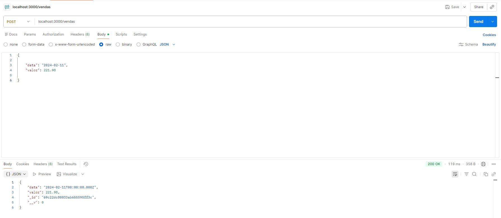
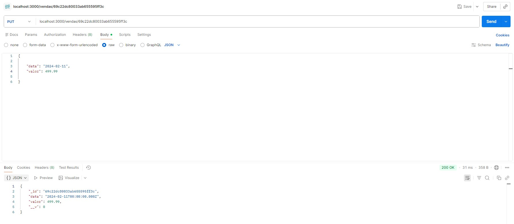
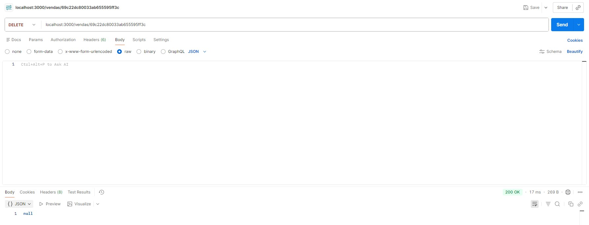
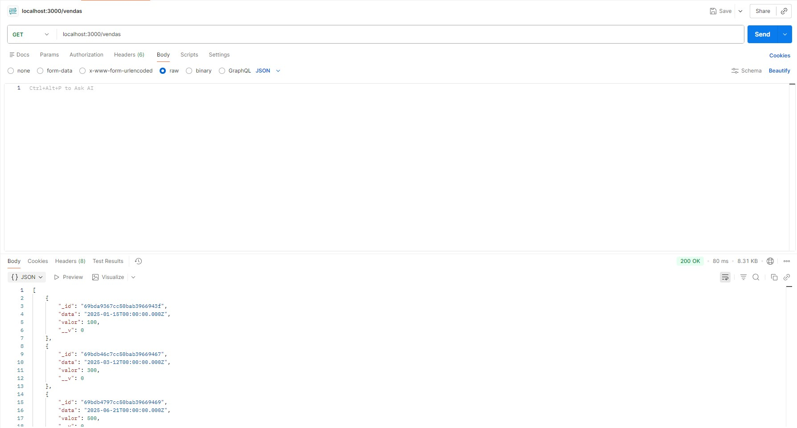

# 🔌 API de Vendas

API desenvolvida para gerenciamento e fornecimento de dados de vendas para um dashboard.

## 🚀 Funcionalidades
- Cadastro de vendas
- Listagem de vendas
- Integração com banco de dados

## 🛠️ Tecnologias utilizadas
- Node.js
- Express
- MongoDB

## 📡 Rotas principais

### 📥 GET /vendas
Retorna todas as vendas registradas em formato JSON

#### 📄 Exemplo de resposta

```json
[
  {
    "_id": "69c0d23307663ca8c44598bc",
    "data": "2025-01-15T00:00:00.000Z",
    "valor": 229.99,
    "__v": 0
  }
]
```

### ➕ POST /vendas
Cria uma nova venda

---

## ▶️ Como rodar o projeto

```bash
npm install
node server.js
```

## 📚 Aprendizados
- Criação de API REST
- Integração com banco de dados
- Estruturação de backend

## 👨‍💻 Autor

Luiz Gustavo

## 📸 Exemplos de requisições (CRUD): 

### ➕ POST /vendas


---

### ✏️ PUT /vendas/:id


---

### ❌ DELETE /vendas/:id


---

### 📥 GET /vendas

